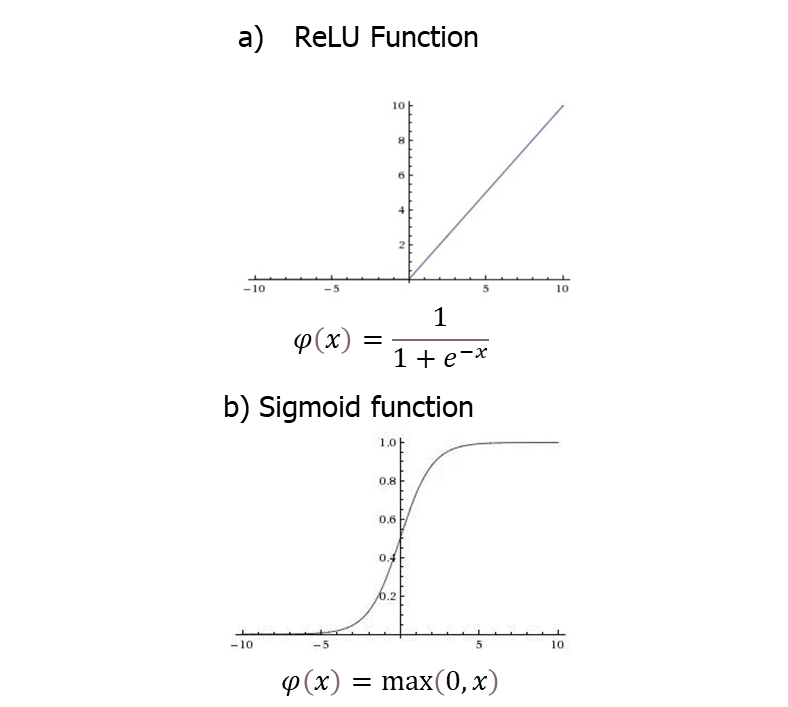

# Face Mask detection 

Xiaohan Feng

Project link：<https://github.com/Dora-fxh/casa0018/tree/main/Assessment/Projects/Final%20Project>

## Introduction
Coronavirus disease 2019 (COVID‐19) spreads widely around the whole world since the end of 2019 (Huang et al., 2020). Many measures have been implemented to curb it, but there are still around 4,550,837 new cases per week in April 2021. According to the Weekly epidemiological update on COVID-19 of the World Health Organization¬—WHO (2021), there have 135,057,587 confirmed cases and 2,919,932 deaths by 13 April 2021. Though many detection and diagnosis methods of COVID-19 has been developed (Bai et al., 2020; Wang et al., 2020), the most effective way to control the epidemic disease nowadays is to wear masks in public, since it can prevent small respiratory droplets from transmitting the virus among people (Howard et al., 2021). Cheng et al. (2020) also verified the contribution of masks in this situation. Most governments around the world encourage and even published temporary legislation to demand citizens to wear face masks in public (Congressional Documents and Publications, 2020). But there are still many people who do not willing or forget to wear face masks when they come into public places. Our project aims to automatically identify whether faces detected are with or without masks. It could be applied in some public places and signal the guards when finding someone who does not abide by the regulations. In this case, guards do not need to patrol around or staring surveillance cameras all the time. A lot of work for guards can be saved and the effectiveness is also improved. 

## Research Question
How to use the webcam to detect whether people wear masks properly and what measures can be taken to improve the accuracy of the face mask detection model which is originally base on the simple [Cats vs Dogs](https://github.com/djdunc/casa0018/blob/main/Week2/CASA0018_2_3_Cats_v_Dogs.ipynb) example?

## Application Overview
Following diagram shows how our application goes. The main loop contains 4 steps. Firstly, the image is captured from the web camera using the OpenCV library. Secondly, the function called CascadeClassifie in OpenCV and the haarcascade_frontalface_alt2.xml file (this file could be found in your cv2 folder when you successfully downloaded the opencv library. I also attached the file in case you cannot find it) is utilized to detect and locate the face. After that, the mask classification model we trained is used to identify whether the face detected has a mask or not. Lastly, if the probability of no mask is larger than 0.5, a no-mask label will show above the face detected.

What was talked about above is the final one—all the components were connected to the main loop with the red line, while those connected with black one is other trails we did. At first, the arducam is used in the camera model(the ① in the figure). However, we find the arducam did not work and after the detailed check (the main steps is in following figures) , we consider it’s broken (we checked using the ArduCAM_Mini_2MP_Plus_function. Before uploading, we make sure only uncomment the hardware platform we need in memorysaver.h. After uploading successfully, we double checked the wiring and Arducam pins and Arduino pins are correspondingly connected. Then, we open the app called ArduCam_Host_V2 and comfirms that the port is com5 which is consistent with Arduino IDE). However, if it works, we will not need the face detection part and the final model we need will be tflite file(tflite of int8,uint8 and int16 are produced as we also tried to deploy the model in the andriod APP). Besides, the input image size will also be smaller than our current one (the rows and columns of the image’s pixels will be 96x96 and the number of color channels used to represent each pixel will be 1—grayscale).
For the face detection model, at first, the paddle library is used. However, it’s very complicated when transforming our saved_model into the model that paddle accepted which is in the grey part. Then, we turn to the dlib library, but the effect is still not good as when we put on the mask, it’s hard to detect our face. At last we find the one we actually used. Although it works, it require a computer with High-end configuration. Otherwise, it will be quite slow during detection.

## Data
The main data set we used is collected by AIZOO and can be downloaded [here]<https://drive.google.com/file/d/1QspxOJMDf_rAWVV7AU_Nc0rjo1_EPEDW/view>.
It contains two folders, one is for training which has 6120 images (3006 of them come from the MAFA dataset with face masks and 3114 from WIDER Face without masks), the other is as the validation set and has 1839 pictures(contains 799 mask samples and 1040 no-mask samples). Although the dataset with mask and with no masks was mixed together, every image has a corresponding XML file which includes the label, the bounding box of the face, etc. Thus, we use the label in the XML file to divide the data set into what is similar to the ‘Cats vs Dogs’ example. During this process, two images in the training folder are detected with the wrong filename extension(not belong to any suffix names of the image file like webp, jpeg, jpg, and png.), so they were deleted. At the same time, all the figures are filled into squares since directly squeeze them into a square will distort the figures. An example of an original picture and its distorted picture and the filled picture is as follows：

However, when all the experiment was done, we find that no matter what parameters we adjust, the accuracy is still relatively low (less than 70%). The reason may relate to our dataset. Our model is a classification model, if there are many other distractions in the background (like there are some other people besides our object), the accuracy will be largely influenced. In this case, we decide to crop only the face in the picture by the bounding boxes got from the XML File. Additionally, we realize that although the model might perform well in the existing “perfect” dataset, it might underfit the new data. Thus, we will not fill the cropped data into squares. These three pictures show the initial dataset and what the data processed by two different processing methods like. 

Moreover, when generating data using ImageDataGenerator function, we randomly rescale, flip, shear, zoom, reotate and shift the photo to produce more samples to adapt the changeable environment. The figure below shows how our generator works.

Another dataset which is similar to our cropped dataset and consists of 700 images belonging to two classes(with mask: 350, without mask: 350) from [here]<https://github.com/chandrikadeb7/Face-Mask-Detection>. It is only used as the testing set to roughly test our model, because in its mask folder, there are some people whose mask did not cover their nose. In our model, we do not want the masks are recognized even if they are not properly worn.

## Model
We use the convolutional neural network (CNN) model to do the project. It is a widely used model in the image recognition field, and there are many face-detection studies based on CNN (Seo and Chung, 2019). We define the input shape to be 150x150 pixels with 3 colour depth and the model we final used has 7 layers with the first 4 being a mix of convolution and pooling. It looks as follows:

The role of the convolutional layer is to reduce the images into a form that is easier to process, without losing features that are critical for getting a good prediction and there are 32 and 64 convolutions of size 3x3 for convolution layers separately.
The MaxPooling layer uses the maximum value from the portion of the image to reduce the spatial size of the whole image and thus decrease the computational power (Sumit Saha, 2018). By specifying a size 2x2 we are effectively quartering the size of the image.
Layer 5 is called 'Flatten' which takes the previous layer and turns it into a 1-dimensional set. The 6th layer 'Dense' has 512 neurons and the last layer 'Dense' has 1 neuron. The fully connected layer is used to learn the non-linear combination of the huge-volume features from the convolutional layer and the final classification output (Sumit Saha, 2018). It implements an activation function that looks at all the probabilities in that layer of neurons and sets the highest value to 1 and all the others to 0 - this makes it programmatically easier to find the most likely solution.
For the activation function, 'relu' (Rectified Linear Unit - ReLU) activation function is one of the most commonly activation function used for convolution layer.It converts any negative value to zero and the sigmoid function is often used for binary classifiation because its output range is (0,1).

What's more We use binary crossentropy as the loss function. It evaluated on the log loss between the predicted values and the ground truth.

where $\hat{y_i}$ is the i-th scalar value in the model output, $y_i$ is the corresponding target value, and output size is the number of scalar values in the model output.
and Root Mean Square Propagation as the optimizer
we set the early stop to help us break the training process. When there are 5 epochs with no improvement, the training will be stopped. Also we monitors the validation accuracy and if no improvement is seen for 2 epochs, the learning rate will be reduced to half of it (no less than 1e-5).

We also tried the model with dropout layer. It can probabilistically remove the inputs of a layer, which makes the network more robust to the inputs and  is often used after the pooling layers or the two dense fully connected layers (Brownlee, 2018). Additionally, the number of convolution layer and pooling layer is also changed to make the model more complex. The reason we do not choose them will be discussed later int the experiments part.

## Experiments
What experiments did you run to test your project? What parameters did you change? How did you measure performance? Did you write any scripts to evaluate performance? Did you use any tools to evaluate performance? Do you have graphs of results? 
We use binary crossentropy to calculate the loss 

where $\hat{y_i}$ is the i-th scalar value in the model output, $y_i$ is the corresponding target value, and output size is the number of scalar values in the model output.
Root Mean Square Propagation
## Results and Observations
Synthesis the main results and observations you made from building the project. Did it work perfectly? Why not? What worked and what didn't? Why? What would you do next if you had more time?  
<iframe height=498 width=510 src="https://github.com/Dora-fxh/casa0018/blob/main/Assessment/Report/figures/test.mp4">

*probably ~300 words and remember images and diagrams bring results to life!*

## Bibliography
*If you added any references then add them in here using this format:*

1. Last name, First initial. (Year published). Title. Edition. (Only include the edition if it is not the first edition) City published: Publisher, Page(s). http://google.com

2. Last name, First initial. (Year published). Title. Edition. (Only include the edition if it is not the first edition) City published: Publisher, Page(s). http://google.com

----

## Declaration of Authorship

I, AUTHORS NAME HERE, confirm that the work presented in this assessment is my own. Where information has been derived from other sources, I confirm that this has been indicated in the work.

*Digitally Sign by typing your name here*

ASSESSMENT DATE
